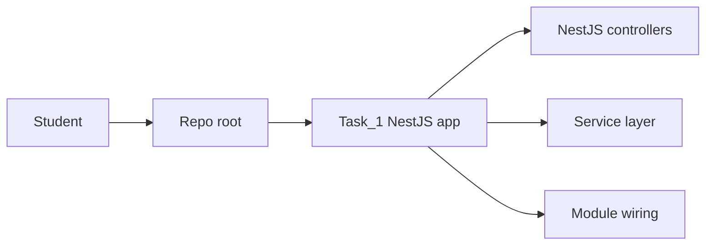

# Advance_WEB_TECH_AIUB

## Architecture / How it Works

```mermaid
flowchart LR
    Student --> Repo[Repo root]
    Repo --> Task1[Task_1 NestJS app]
    Task1 --> Controller[NestJS controllers]
    Task1 --> Service[Service layer]
    Task1 --> Module[Module wiring]
```
